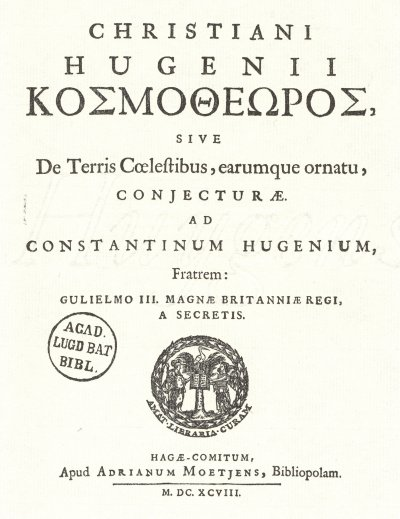
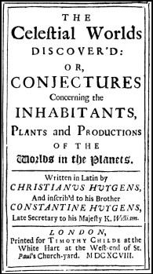

Cosmotheoros
============

*"The Celestial Worlds discover'd: Or, Conjectures concerning the inhabitants, plants and productions of the worlds in the planets"*

This repository holds the finished PDF and source files for my typeset version of Christiaan Huygens' scientific and philosophical work, which he finished shortly before his death and was published posthumously.

I have found the text and images at the web page of [R.H. van Gent], cleaned the figures a bit in [Gimp], and typeset the text with $\rm Xe\LaTeX$ and the great `fontspec` package. 

I have used the image of the Latin version of the book found on R.H. van Gents site as the cover, and typeset a version based on pictures of the original English version as the title page. 

## Fonts and typesetting

I have spent some time looking around for good fonts to emulate the old-style Latin letters of the late 17th century, when I stumbled onto the fantastic [Fell Type] fonts designed by Igino Marini, which do just that: Emulate typical typefaces and print quality of that era They are high-quality fonts with great support for OpenType features like historical style, different ligature sets etc. - I think it looks pretty good with these fonts. The fonts do not have a **bold** version, but this was not generally used at the time. This book uses the 'IM Fell English PRO' font. Best of all: They are free and open source!

The use of the 'Long s'  (ſ) character follows the rules listed at the [Babelstone] blog for 17th century books. XeLaTeX has some support for simple rules, but as is described in the Babelstone blog post, these rules (basically: Short 's' at the end of words, long 'ſ' at the beginning and inside of words) are somewhat over/simplified and inacccurate.

[R.H. van Gent]: http://www.staff.science.uu.nl/~gent0113/huygens/huygens_ct_en.htm
[Gimp]: http://www.gimp.org
[Fell Type]: http://iginomarini.com/fell/the-revival-fonts/
[Babelstone]: http://babelstone.blogspot.se/2006/06/rules-for-long-s.html
